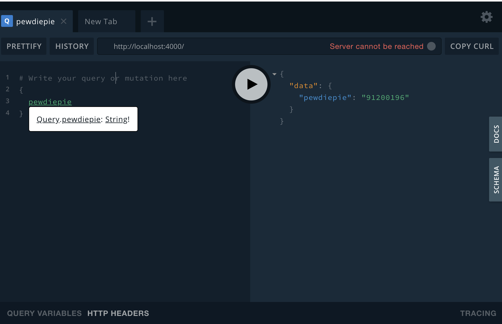
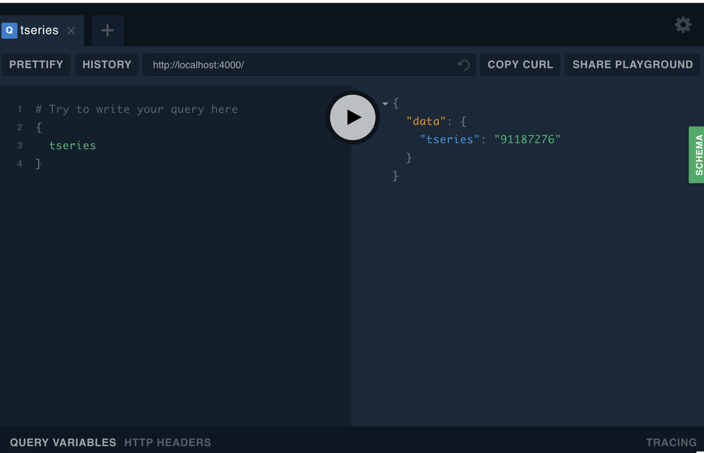

# GraphQL-TSERIES-vs-PEWDIEPIE
Simple example of wrapping REST API with GraphQL. 
Youtube REST api to get subscription count is wrapper in the resolver.
> You will need to get your <a href= "https://console.developers.google.com/projectselector2/apis/credentials?supportedpurview=project">
API key from youtube </a>
## Getting started

```sh
yarn install
yarn start
```

It will Spin up a GraphQL server (graphql-yoga) on port 4000 with GraphiQL UI

### Queries

#### PewDiePie


#### T-Series

